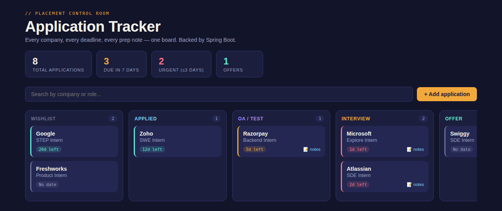
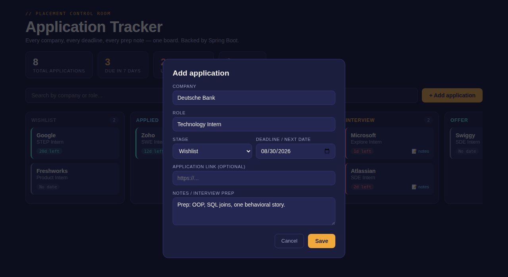

# Placement Tracker

A full-stack internship/placement application tracker: **Java (Spring Boot)** backend with a REST API, **H2** file database for persistence, and a vanilla **HTML/CSS/JavaScript** frontend served as static files.



<details>
<summary>Add application modal</summary>



</details>

> Screenshots use sample data for demonstration.

## Stack
- Java 17
- Spring Boot 3.3 (Web, Data JPA, Validation)
- H2 database (file-based — your data survives restarts, stored in `./data/`)
- HTML/CSS/JS frontend (no build step, no frameworks)

## Prerequisites
- Java 17 or newer (`java -version`)
- Maven 3.8+ (`mvn -version`) — or just use the included wrapper if you add one

## Run it

```bash
cd placement-tracker
mvn spring-boot:run
```

Then open **http://localhost:8080** in your browser.

The first run creates a `data/` folder next to the project with the H2 database file — that's where all your applications live. Delete that folder to reset everything.

## Build a runnable jar

```bash
mvn clean package
java -jar target/placement-tracker.jar
```

## REST API

| Method | Endpoint                  | Description                    |
|--------|----------------------------|---------------------------------|
| GET    | `/api/applications`        | List all applications           |
| GET    | `/api/applications/stats`  | Summary stats (totals, urgent, offers) |
| POST   | `/api/applications`        | Create an application           |
| PUT    | `/api/applications/{id}`   | Update an application           |
| DELETE | `/api/applications/{id}`   | Delete an application            |

Example request body for POST/PUT:

```json
{
  "company": "Atlassian",
  "role": "SDE Intern",
  "stage": "APPLIED",
  "deadline": "2026-09-15",
  "link": "https://atlassian.com/careers/123",
  "notes": "Round 1: DSA + system design basics"
}
```

Valid `stage` values: `WISHLIST`, `APPLIED`, `TEST`, `INTERVIEW`, `OFFER`, `REJECTED`.

## Project structure

```
placement-tracker/
├── pom.xml
├── src/main/java/com/tracker/
│   ├── PlacementTrackerApplication.java   # entry point
│   ├── model/
│   │   ├── JobApplication.java            # JPA entity
│   │   └── Stage.java                     # pipeline stage enum
│   ├── dto/JobApplicationRequest.java     # request body validation
│   ├── repository/JobApplicationRepository.java
│   └── controller/JobApplicationController.java  # REST endpoints
└── src/main/resources/
    ├── application.properties
    └── static/
        ├── index.html
        ├── css/style.css
        └── js/app.js
```

## Notes
- CORS is not configured because the frontend is served by the same Spring Boot app — no separate frontend server needed.
- To switch to a "real" database (Postgres/MySQL) later, just swap the `spring.datasource.*` properties in `application.properties` and add the matching JDBC driver dependency to `pom.xml`.
